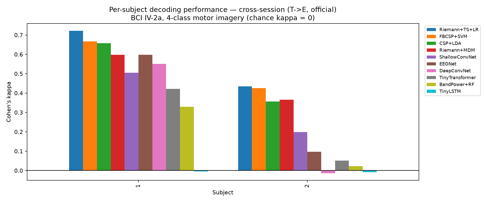
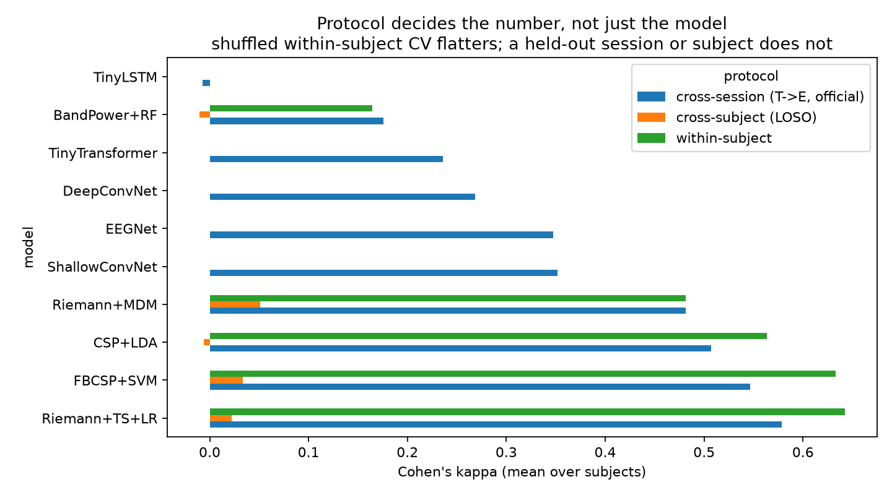
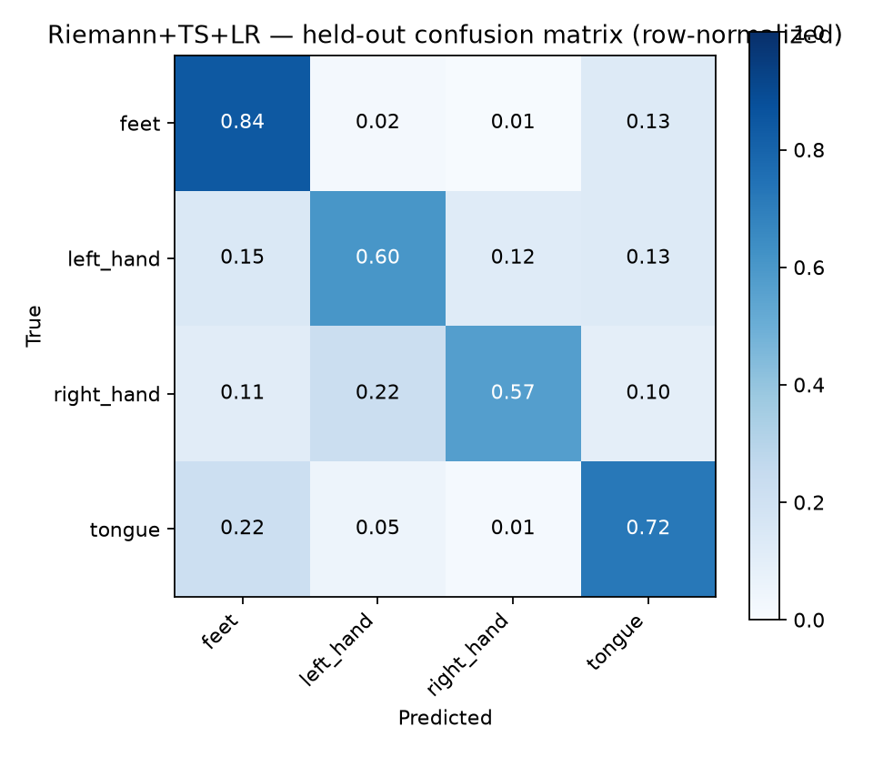

## Results

BCI Competition IV-2a (`BNCI2014_001`), 22 EEG channels, 4-class motor imagery (left hand / right hand / feet / tongue), 8–30 Hz band-pass, seed 42.
**Headline protocol: cross-session (T->E, official).** Chance kappa = 0.

> **Caveat — 2 of 9 subjects (S1, S2).** The dataset's only host, `lampx.tugraz.at`, accepts the TCP connection on :443 and then drops the TLS handshake; `bnci-horizon-2020.eu` just 302s to the same machine. Only these subjects were already cached. `scripts/fetch_iv2a.py --watch` polls for the rest and the full run is one command once they land. Every number below is real but rests on a small sample — treat the per-subject spread, not the mean, as the honest summary.

### cross-session (T->E, official)

| model | family | Cohen's kappa | balanced acc | n subj |
|---|---|---|---|---|
| Riemann+TS+LR | classical | 0.579 ± 0.203 | 0.684 ± 0.152 | 2 |
| FBCSP+SVM | classical | 0.546 ± 0.170 | 0.660 ± 0.128 | 2 |
| CSP+LDA | classical | 0.507 ± 0.213 | 0.630 ± 0.160 | 2 |
| Riemann+MDM | classical | 0.481 ± 0.164 | 0.611 ± 0.123 | 2 |
| ShallowConvNet | deep | 0.352 ± 0.216 | 0.514 ± 0.162 | 2 |
| EEGNet | deep | 0.347 ± 0.354 | 0.510 ± 0.265 | 2 |
| DeepConvNet | deep | 0.269 ± 0.399 | 0.451 ± 0.300 | 2 |
| TinyTransformer | deep | 0.236 ± 0.262 | 0.427 ± 0.196 | 2 |
| BandPower+RF | classical | 0.176 ± 0.216 | 0.382 ± 0.162 | 2 |
| TinyLSTM | deep | -0.007 ± 0.003 | 0.245 ± 0.002 | 2 |

### cross-subject (LOSO)

| model | family | Cohen's kappa | balanced acc | n subj |
|---|---|---|---|---|
| Riemann+MDM | classical | 0.051 ± 0.059 | 0.288 ± 0.044 | 2 |
| FBCSP+SVM | classical | 0.034 ± 0.041 | 0.275 ± 0.031 | 2 |
| Riemann+TS+LR | classical | 0.022 ± 0.008 | 0.266 ± 0.006 | 2 |
| CSP+LDA | classical | -0.006 ± 0.008 | 0.246 ± 0.006 | 2 |
| BandPower+RF | classical | -0.010 ± 0.038 | 0.242 ± 0.028 | 2 |

### within-subject

| model | family | Cohen's kappa | balanced acc | n subj |
|---|---|---|---|---|
| Riemann+TS+LR | classical | 0.642 ± 0.182 | 0.732 ± 0.136 | 2 |
| FBCSP+SVM | classical | 0.633 ± 0.178 | 0.725 ± 0.134 | 2 |
| CSP+LDA | classical | 0.564 ± 0.123 | 0.673 ± 0.092 | 2 |
| Riemann+MDM | classical | 0.481 ± 0.239 | 0.611 ± 0.179 | 2 |
| BandPower+RF | classical | 0.164 ± 0.236 | 0.373 ± 0.177 | 2 |

### The leakage demo

Fitting CSP on **all** data before splitting inflates balanced accuracy from **0.246** (honest, fit in-fold) to **0.324** — a free **+0.078** that is entirely an artifact of peeking.

### Figures

